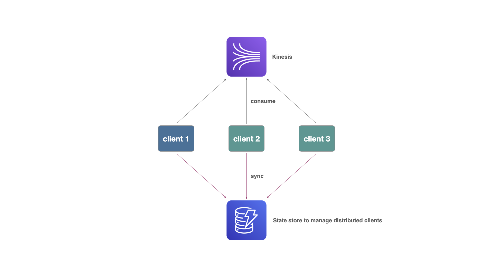
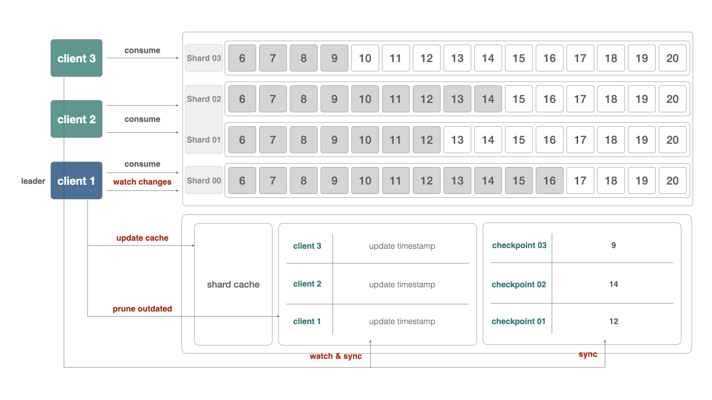

# Kinesumer

[](https://github.com/daangn/kinesumer/actions/workflows/test.yml) [](https://github.com/daangn/kinesumer/releases)

Kinesumer is a Go client implementing a client-side distributed consumer group client for [Amazon Kinesis](https://aws.amazon.com/kinesis/). It supports following features:

- Implement the client-side distributed Kinesis consumer group client.
- A client can consume messages from multiple Kinesis streams.
- Clients are automatically assigned a shard id range for each stream.
- Rebalance each shard id range when clients or upstream shards are changed. (by restart or scaling issues)
- Manage the checkpoint for each shard, so that clients can continue to consume from the last checkpoints.
- Able to consume from the Kinesis stream in a different AWS account.
- Manage all the consumer group client states with a DynamoDB table. (we call this table as `state store`.)



## Setup

Kinesumer manages the state of the distributed clients with a database, called "state store". It uses the DynamoDB as the state store, so you need to create a DynamoDB table first. Create a table with [LSI schema](./schema/ddb-lsi.json). See the details in [here](#how-it-works).

> Current state store implementation supports multiple applications (you will pass the app name when initialize the client). So, if you already have a kinesumer state store, you don't need to create another state store table.

### If your Kinesis stream is in different account

> If you want to connect to Kinesis in a different account, you need to set up the IAM role to access to the target account, and pass the role arn (`kinesumer.Config.RoleARN`) when initialze the Kinesumer client: [Reference](https://docs.aws.amazon.com/kinesisanalytics/latest/java/examples-cross.html).
> 

## Usage

```go
package main

import (
    "fmt"
    "time"

    "github.com/daangn/kinesumer"
)

func main() {
    client, err := kinesumer.NewKinesumer(
        &kinesumer.Config{
            App:            "myapp",
            KinesisRegion:  "ap-northeast-2",
            DynamoDBRegion: "ap-northeast-2",
            DynamoDBTable:  "kinesumer-state-store",
            ScanLimit:      1500,
            ScanTimeout:    2 * time.Second,
        },
    )
    if err != nil {
        // Error handling.
    }

    go func() {
        for err := range client.Errors() {
            // Error handling.
        }
    }()

    // Consume multiple streams.
    // You can refresh the streams with `client.Refresh()` method.
    records, err := client.Consume([]string{"stream1", "stream2"})
    if err != nil {
        // Error handling.
    }

    for record := range records {
        fmt.Printf("record: %v\n", record)
    }
}
```

## How it works

Kinesumer implements the client-side distributed consumer group client without any communications between clients. Then, how do clients know the state of an entire system? The answer is the distributed key-value store.

To evenly distribute the shard range among clients, the Kinesumer relies on a centralized database, called `state store`. State store manages the states of the distributed clients, shard cache, and checkpoints.

This is the overview architecture of Kinesumer:



Following explains how the Kinesumer works:

- **Leader election**: Clients register themselves to the state store and set their indexes. The index is determined by sorting all active client ids. And, a client who has zero index will be a leader. So, when clients are scaled or restarted, the leader could be changed.
- **Shard rebalancing**: A client will fetch the full shard id list and client list from the state store. Then, divide the shard id list by the number of clients and assign a range of shard id corresponding to their index. All clients will repeat this process periodically.
- **Synchronization**: The leader client is responsible to sync the shard cache with the latest shard list, and pruning the outdated client list (to prevent the orphan shard range) periodically.
- **Offset checkpoint**: Whenever a client consumes messages from its assigned shards, it updates a per-shard checkpoint with the sequence number of the last message read from each shard.

## License

See [LICENSE](./LICENSE).

